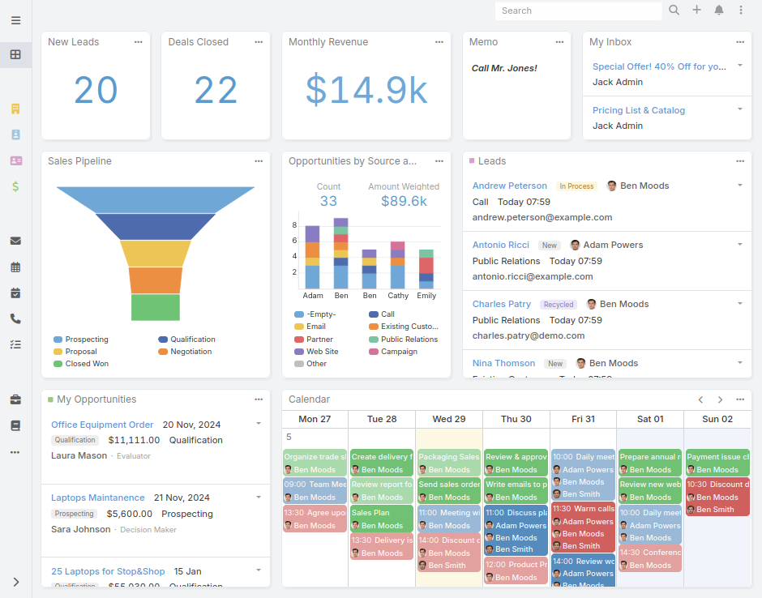

<!--
Ohart ongi: README hau automatikoki sortu da <https://github.com/YunoHost/apps/tree/master/tools/readme_generator>ri esker
EZ editatu eskuz.
-->

# EspoCRM YunoHost-erako

[](https://ci-apps.yunohost.org/ci/apps/espocrm/)


[](https://install-app.yunohost.org/?app=espocrm)

*[Irakurri README hau beste hizkuntzatan.](./ALL_README.md)*

> *Pakete honek EspoCRM YunoHost zerbitzari batean azkar eta zailtasunik gabe instalatzea ahalbidetzen dizu.*  
> *YunoHost ez baduzu, kontsultatu [gida](https://yunohost.org/install) nola instalatu ikasteko.*

## Aurreikuspena

EspoCRM is a free, open-source CRM platform designed to help organizations build and maintain strong customer relationships. It provides a wide range of tools to store, organize, and manage leads, contacts, sales opportunities, marketing campaigns, support cases, and more – all business information in a simple and intuitive interface.


**Paketatutako bertsioa:** 9.0.4~ynh1

**Demoa:** <https://www.espocrm.com/demo/>

## Pantaila-argazkiak



## Dokumentazioa eta baliabideak

- Aplikazioaren webgune ofiziala: <https://www.espocrm.com>
- Administratzaileen dokumentazio ofiziala: <https://docs.espocrm.com/>
- Jatorrizko aplikazioaren kode-gordailua: <https://github.com/espocrm/espocrm>
- YunoHost Denda: <https://apps.yunohost.org/app/espocrm>
- Eman errore baten berri: <https://github.com/YunoHost-Apps/espocrm_ynh/issues>

## Garatzaileentzako informazioa

Bidali `pull request`a [`testing` abarrera](https://github.com/YunoHost-Apps/espocrm_ynh/tree/testing).

`testing` abarra probatzeko, ondorengoa egin:

```bash
sudo yunohost app install https://github.com/YunoHost-Apps/espocrm_ynh/tree/testing --debug
edo
sudo yunohost app upgrade espocrm -u https://github.com/YunoHost-Apps/espocrm_ynh/tree/testing --debug
```

**Informazio gehiago aplikazioaren paketatzeari buruz:** <https://yunohost.org/packaging_apps>
